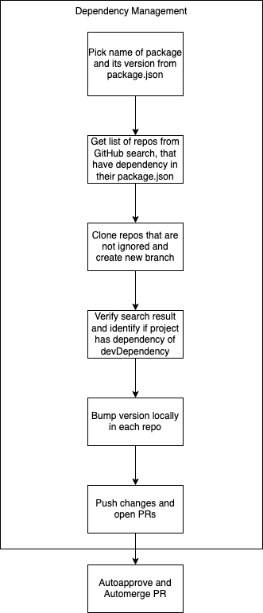

# Organization Projects' Dependency Manager
GitHub Action that handles automated update of dependencies in package.json between projects from the same GitHub organization.

<!-- toc -->

- [Why I Created This Action?](#why-i-created-this-action)
- [How It Works?](#how-it-works)
- [Tests](#tests)
- [Action Flow](#action-flow)
- [Configuration](#configuration)
- [Example](#example)
- [Development](#development)

<!-- tocstop -->

## Why I Created This Action?

GitHub Action that handles automated update of dependencies in package.json between projects from the same GitHub organization.

The main goal was to automate bump of dependencies between packages from the same organization. You might have several projects depending on each other, and your option to efficiently work with them should not only be a monorepo. In my opinion, people reach for monorepo to quickly, letting themselves to solve one complex problem by introducing another one. 

You cannot apply monorepo everywhere, sometimes it doesn't make sense, and you still have some dependencies that you need to bump manually. This action doesn't have such a problem.

## How It Works?

tl;dr To find dependent projects, GitHub Search is utilized.

Before you run this action, I suggest you first use manually the search query used by this action. Go to https://github.com and in search box paste `"@myorg/test" user:myorg in:file filename:package.json` (with proper names of course). Identify repositories that have your package in dependencies, but you do not want to automatically update it. Add it to the list of ignored repositories

1. You run this action in package `@myorg/test`
1. After releasing `@myorg/test`, you want latest version of the package to be bumped in other packages in your organization/user called `myorg`
1. The following search is performed `"@myorg/test" user:myorg in:file filename:package.json`
1. Search is not perfect, quotations from `"@myorg/test"` are ignored and result can also contain repositories that have only `@myorg/test-sdk` as dependency
1. All found repositories are cloned (except of `@myorg/test`)
1. Action verifies if you really have `@myorg/test` in dependencies or devDependencies
1. Now the rest, bumping + pushing + creating a pull request

Approach with using GitHub search has only one disadvantage, bumping will not work in forks, as forks do not show up in search results. It is still better than cloning all repositories from your organization.

## Tests

I provided only unit tests for essential utils. There are no integration tests as I have no clear idea of how they would look like and prefer to test manually every change for the time being. I have a test organization that I test against all cases and am 100% sure all works as expected. Is it lame? :man_shrugging:. I don't see a point to invest time into more sophisticated automated tests if, at the moment, I'm the only one interested in this GitHub Action. I'm happy to work on this. Just report an issue, and if possible, suggest a solution.

## Action Flow

  

## Configuration

Name | Description | Required | Default
--|------|--|--
github_token | Token to use GitHub API. It must have "repo" scopes so it can push to repos. It cannot be the default GitHub Actions token GITHUB_TOKEN. GitHub Action token's permissions are limited to the repository that contains your workflows. Provide token of the user that has rights to push to the repos that this action is suppose to update.  | true | -
packagejson_path | Path to package.json file if not located in the root of the project. Provide just the path without file name. In the format: `./nested/location`. | false | `./`
committer_username | The username (not display name) of the committer will be used to commit changes in the workflow file in a specific repository. In the format `web-flow`. | false | `web-flow`
committer_email | The committer's email that will be used in the commit of changes in the workflow file in a specific repository. In the format `noreply@github.com`.| false | `noreply@github.com`
commit_message_prod | It is used as a commit message when bumping dependency from "dependencies" section in package.json. In case dependency is located in both dependencies and devDependencies of dependant, then prod commit message is used. It is also used as a title of the pull request that is created by this action. | false | `Update dependency`
commit_message_dev | It is used as a commit message when bumping dependency from "devDependencies" section in package.json. It is also used as a title of the pull request that is created by this action. | false | `Update devDependency`
repos_to_ignore | Comma-separated list of repositories that should not get updates from this action. Action already ignores the repo in which the action is triggered so you do not need to add it explicitly. In the format `repo1,repo2`. | false | -

## Example

Below you can find full example for this GitHub Action used agains **release** webhook. You can also use it in other events. This action doesn't read events, it just runs when triggered. In only needs access to the `package.json` of the repository in which it is running. This means you can integrate it with other workflows, like your release workflow.

```yml
name: Bump package version in dependent repos

on:
  release:
    types:
      - published

jobs:

  bump:
    runs-on: ubuntu-latest
    steps:
      - uses: actions/checkout@v2
      - name: Bumping
        uses: derberg/org-projects-dependency-manager@v1
        with:
          github_token: ${{ secrets.CUSTOM_TOKEN }}
          repos_to_ignore: repo1,repo2
          packagejson_path: ./custom/path
          committer_username: pomidor
          committer_email: pomidor@pomidor.com
          #This is commit message and PR title for repos where this package is in dependencies
          commit_message_prod: "fix: update internal production dependencies"
          #This is commit message and PR title for repos where this package is in devDependencies
          commit_message_dev: "chore: update internal development dependencies"
```

## Development

```bash
# GITHUB_TOKEN provide personal GitHub token with scope to push to repos
# GITHUB_REPOSITORY provide name of org/user and the repo in which this workflow is suppose to run
# PACKAGE_JSON_LOC=test is a path to package.json file against you want to test
GITHUB_TOKEN=token PACKAGE_JSON_LOC=test GITHUB_REPOSITORY="lukasz-lab/.github" npm start
```